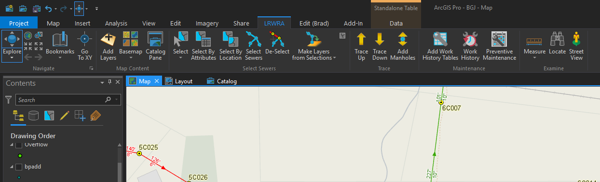

# ArcGIS-Pro-LRWRA
Primary ArcGIS Pro add-in created for Little Rock Water Reclamation Authority GIS users.  This add-in uses a combination of controls created by me (Bradley Jones - controls highlighted in red in **Getting Started** image) and existing ArcGIS Pro controls that I incorporated through the **Daml.cs** and **Config.daml** files.  

Add-in also contains code to log all exceptions thrown by users to a **.txt** file on my organizations network.

 Original tools and controls used in this add-in can also be found in individual repositories

[**Add Layers**](https://github.com/dogwoodgeo/ArcGIS-Pro-AddLayers)

[**Google Street View**](https://github.com/dogwoodgeo/ArcGIS-Pro-GoogleStreetView)

[**Select Sewers**](https://github.com/dogwoodgeo/ArcGIS-Pro-SewerSelect)

[**Trace**](https://github.com/dogwoodgeo/ArcGIS-Pro-Trace)

[**Get Preventive Maintenance**](https://github.com/dogwoodgeo/ArcGIS-Pro-PrevMaint)

[**Add Work History Tables**](https://github.com/dogwoodgeo/ArcGIS-Pro-AddWorkHistTables)

**Get Work History** This tool works similarly to *Get Preventive Maintenance*

****************

**Update**: Fixed a bug in the Trace tool that caused it to hang-up and required you to shut ArcGIS Pro down in Task Manager.  See the Trace repository above for more information.

**Note**: I am a novice .Net developer, at best.  The add-in works, but feel free to let me know if you see any code that is "wrong" or just plain bad.  

## Getting Started

Clone or download the repository. Open Visual Studio 2015 or 2017, build solution, launch ArcGIS Pro and check the **LRWRA** tab.




**NOTE**: You may want to change **SysModule.LogError()** to to meet you own needs. 

### Prerequisites

```
Language:				C#
Contributor:			Bradley Jones, bjones@dogwoodgeo.com
Organization:			Little Rock Water Reclamation Authority (LRWRA)
Org Site:				https://git.lrwu.com/portal
Date:					3/6/2019
ArcGIS Pro:				2.3
ArcGIS Pro SDK:			2.3
Visual Studio:			2017, 2015
.NET Target Framework:	4.6.1
```

### How To Use Add-In

See **README** files for individual add-ins in the links above for instructions on how to use tools and controls.


